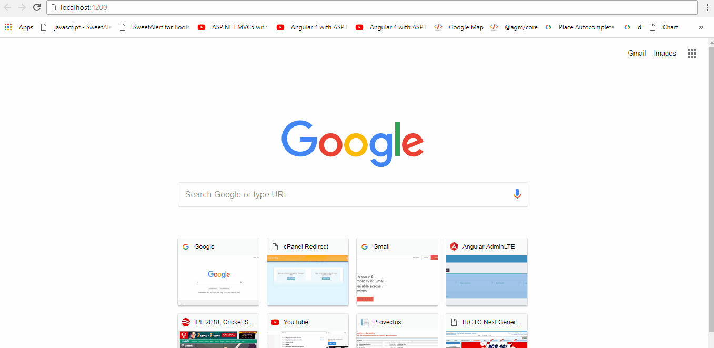

Location App
=====================

**A sample location app where user can fetch the all location, Create/Update/Delete the location.

## Requirements
* Git
* Node
* Express
* MongoDB
* Angular

## Common setup

To run the nodeJS API app follow the given steps

```bash
git clone https://github.com/1expertdevv/LocationApp.git
```
then to run the NodeJS base API application, (mongo db should be running) 
```bash
cd LocationApp/location-API
npm install
npm start
```
Test the API at: http://localhost:3000/

To run Angular based front end application, go to root folder of project
```bash
cd LocationApp/location-App-Ui
npm install
ng serve
```

Browse the application on: http://localhost:4200/




